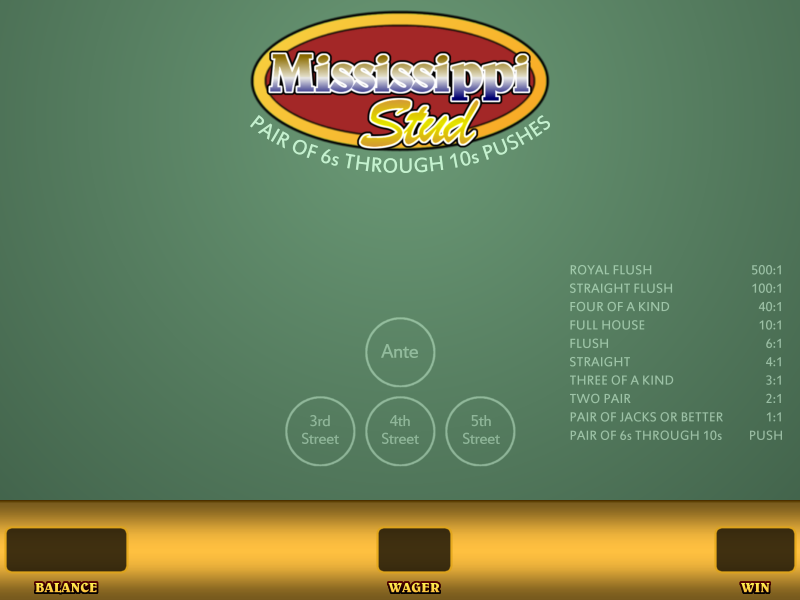

# Mississippi-Stud
 Simulator and odds calculator for Mississippi Stud table game. 

In this table game, the player is dealt 2 cards like in poker, and there are 3 face down community cards. The player will have to put out 1x or 3x ante bets to see each community card. The player will get paid on a payout structure if they have a pair of jacks or better. Pair of 6s to 10s, push. All other hands lose. The player is not playing against the dealer or other players. 

This table game is beatable if you are able to see what other players are holding. This will tell you what's likely or unlikely to be the community cards, and your betting strategy can be adjusted.   
The strategy on how to do this is here: [Optimal strategy](./Documentation/stats_to_remember.md)